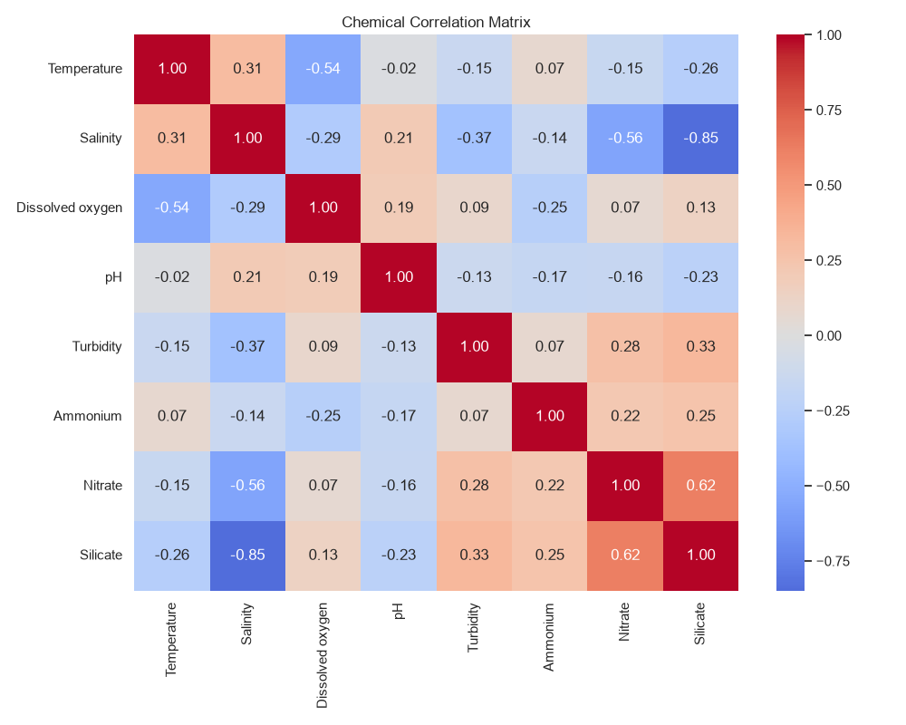
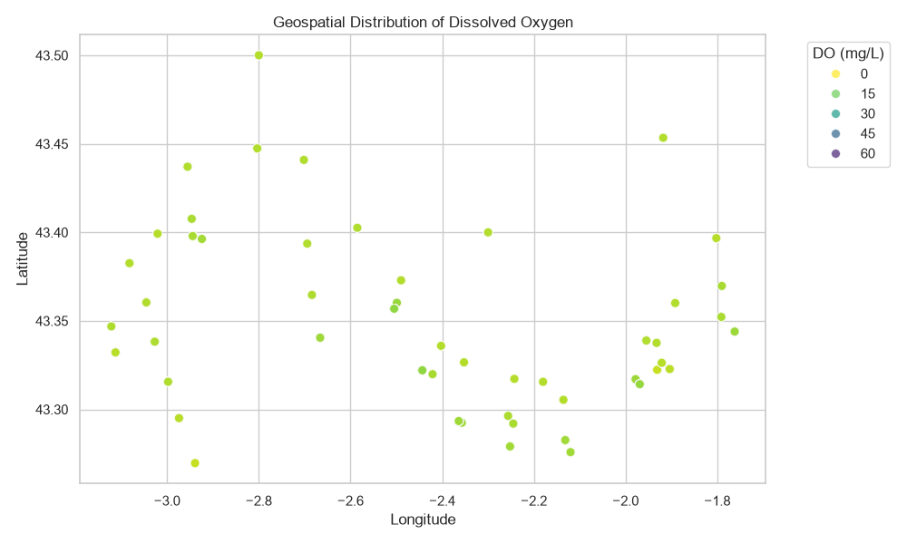
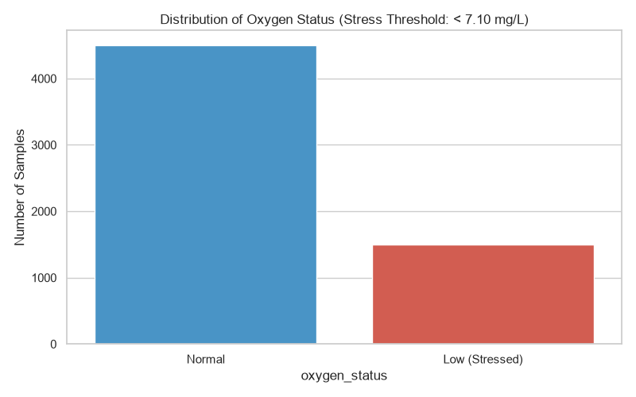
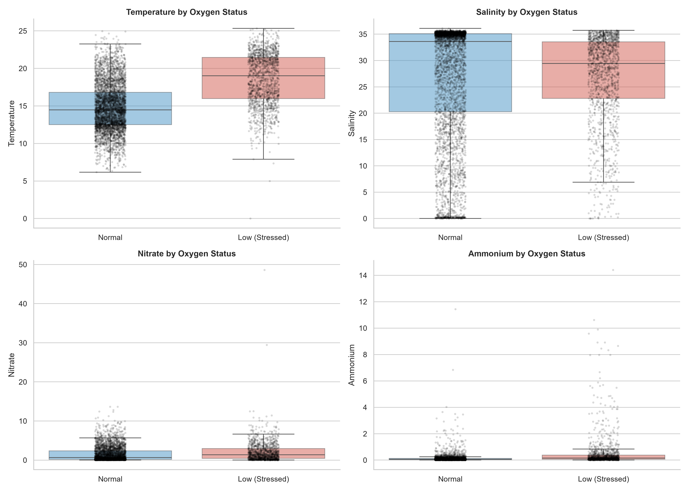
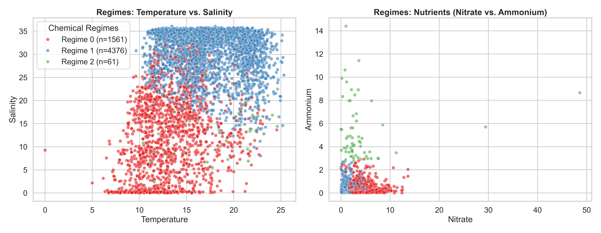
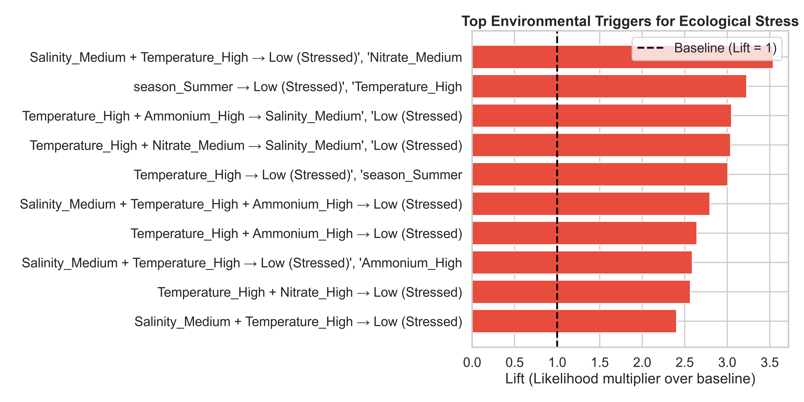
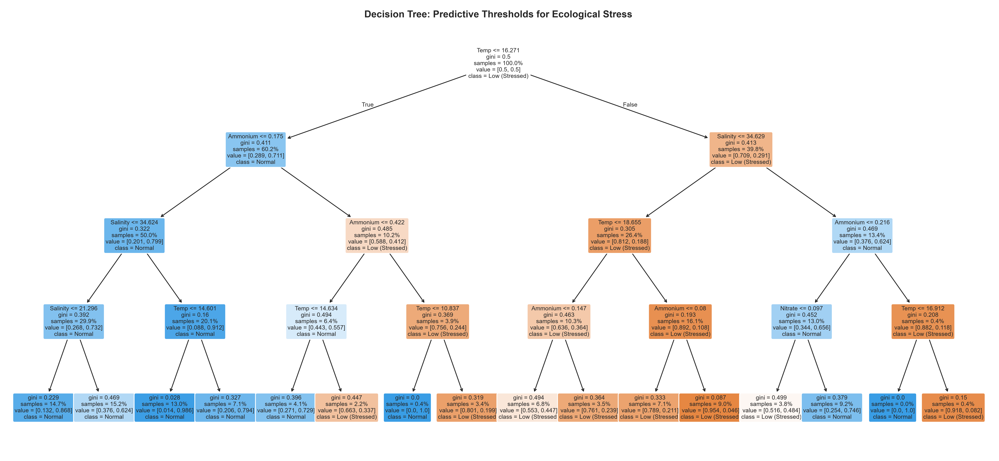
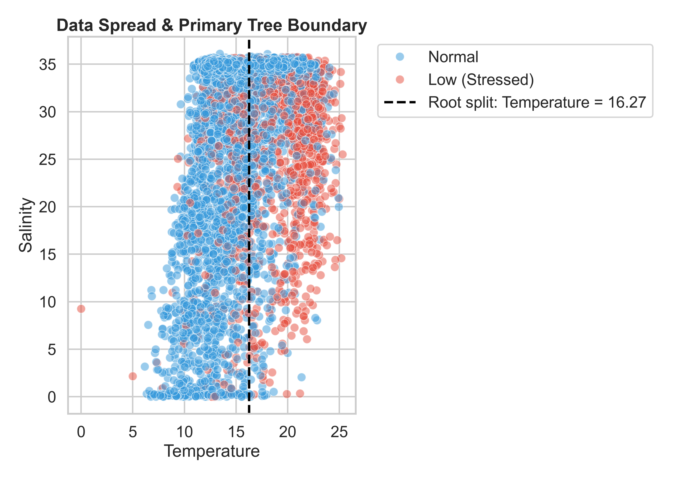
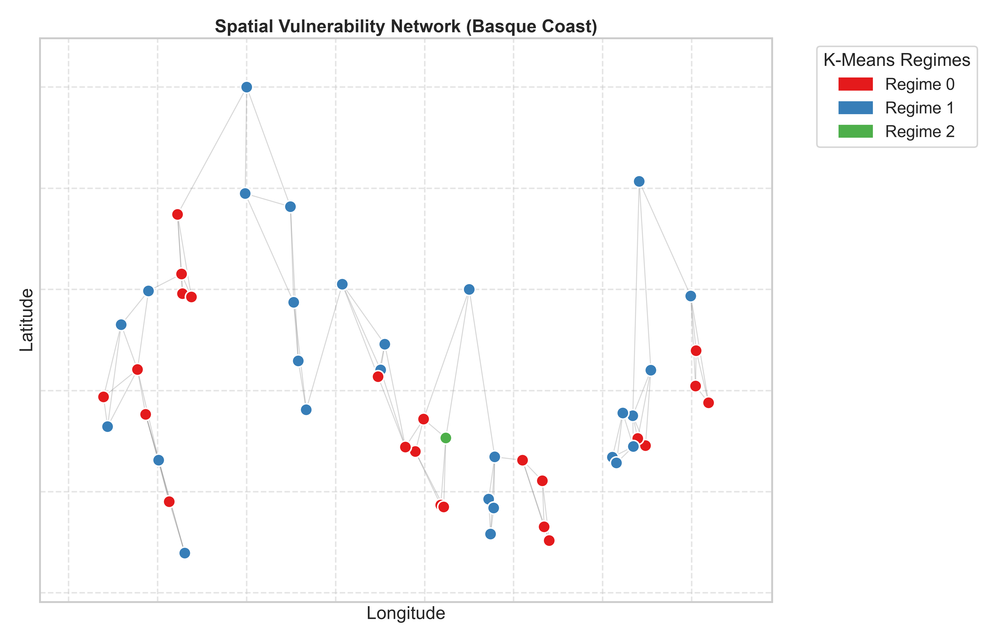
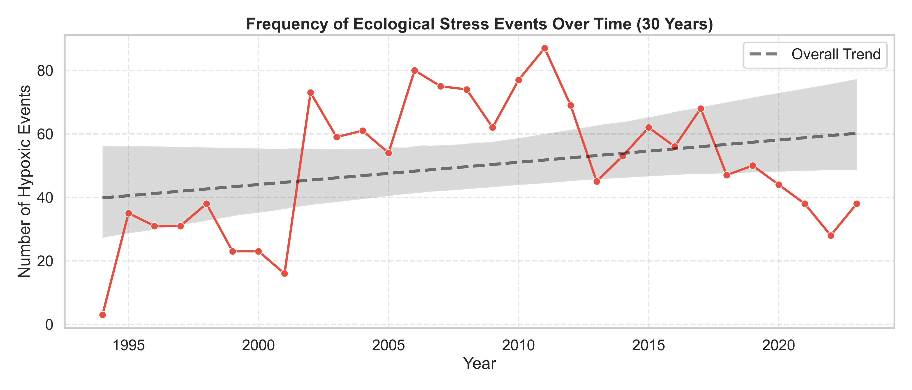

# Coastal Water Quality Analysis: Hypoxia Drivers in the Basque Country (1995–2023)

Mining 30 years of coastal water chemistry to identify the chemical regimes, geographic hotspots, and temperature thresholds that trigger hypoxia in the Basque Country.

## Overview

This project analyzes dissolved oxygen dynamics along the Basque coast using a combination of unsupervised clustering, association rule mining, decision tree classification, and spatial network analysis. The goal is to move beyond simple correlation and produce an actionable risk profile: which chemical conditions precede hypoxic events, where they concentrate geographically, and at what temperature threshold the ecosystem flips into stress. The analysis covers 5,998 water chemistry readings across 166 monitoring stations from 1995 to 2023.

For the detailed analysis, see the report: [Report-Esranur-Aygün-1904469-DataMining.pdf](Report-Esranur-Ayg%C3%BCn-1904469-DataMining.pdf).

## Repository Structure

```
.
├── data/
│   ├── WATER.csv                       # Raw water chemistry records
│   ├── METADATA.csv                    # Station coordinates and metadata
│   └── processed/                      # Cleaned, merged, and clustered datasets
├── outputs/
│   ├── figures/                        # EDA and evaluation visualizations
│   └── models/                         # Saved models, Apriori rules, graph edge lists
├── source/
│   ├── data_load.py                    # Cleaning, merging, EDA, feature engineering
│   ├── analysis.py                     # K-Means, Apriori, Decision Tree, Graph
│   └── eval.py                         # Metrics and plot generation
├── Report-Esranur-Aygün-1904469-DataMining.pdf   # Full project report
├── requirements.txt
└── README.md
```

## Methodology

- **Data**: Basque Country Monitoring Network, 1995–2023. Joined water chemistry (`WATER.csv`) with station metadata (`METADATA.csv`). Biological surveys were excluded due to near-zero overlap with chemistry sampling. Final dataset: **5,998 rows, 166 stations**, features = Temperature, Salinity, Nitrate, Ammonium.
- **Target Variable**: `oxygen_status` — labelled **Low (Stressed)** if dissolved oxygen falls in the lowest 25% of readings (below 7.10 mg/L). Resulting split: 75% Normal / 25% Stressed.
- **EDA**: Correlation matrix to detect multicollinearity (Silicate dropped at −0.85 correlation with Salinity), spatial scatter to confirm station clustering, class balance check, and scatter boxplots by oxygen status.
- **K-Means Clustering**: Unsupervised segmentation of coastal waters into chemical regimes based on Temperature, Salinity, Nitrate, and Ammonium.
- **Association Rule Mining (Apriori)**: Categorical discretization of continuous features to extract frequent condition combinations linked to ecological stress. Rule strength measured by **Lift**.
- **Decision Tree Classification**: Supervised model to extract an explicit temperature threshold for hypoxia onset.
- **Graph Analysis**: K-Nearest-Neighbors spatial network treating stations as nodes to test whether stress is local or regionally connected.

## Findings and Results

### Classification Report (Decision Tree)

| Class            | Precision | Recall | F1-Score | Support |
|------------------|-----------|--------|----------|---------|
| Low (Stressed)   | 0.54      | 0.79   | 0.64     | 300     |
| Normal           | 0.92      | 0.78   | 0.84     | 900     |
| **Accuracy**     |           |        | **0.78** | 1200    |

### Key Findings

- **Chemical regimes**: K-Means separated the coast into 3 distinct regimes — a dominant open-ocean baseline (4,376 samples, high salinity, cool), a widespread estuarine regime (warm, low salinity), and a small but extreme pollution cluster (61 samples, very high Ammonium/Nitrate spikes).
- **Hypoxia triggers**: Apriori produced 63 rules. The strongest combination — **Medium Salinity + High Temperature** — carried a **Lift of 3.54**, meaning hypoxic stress is roughly 3.5× more likely when summer heatwaves coincide with estuarine mixing zones.
- **Predictive threshold**: The decision tree's first split at **16.27°C** cleanly separates most stressed readings. Recall of **0.79** on the stressed class means the model catches ~79% of hypoxic events — appropriate for early-warning use, where false negatives are costlier than false alarms.
- **Spatial contagion**: The 51-node, 153-edge graph shows stressed stations form tight, geographically contiguous clusters inside sheltered bays — not scattered random events. Management should target specific vulnerable hubs rather than apply uniform regional rules.
- **30-year trend**: Hypoxic events have risen from ~30–40 per year in the mid-1990s to 60–80 in recent years, consistent with shifting thermal baselines under climate change.

### Figures

| Figure | Description |
|--------|-------------|
|  | Chemical correlation matrix |
|  | Geospatial distribution of dissolved oxygen |
|  | Distribution of oxygen status |
|  | Feature scatter boxplots by oxygen status |
|  | Dual scatter plots of K-Means regimes |
|  | Top environmental triggers for stress |
|  | Decision tree structure |
|  | Data spread and primary tree boundary |
|  | Spatial vulnerability network |
|  | Frequency of stress events over time |.

## How to Reproduce

### 1. Setup

```bash
git clone <your-repo-url>
cd <your-repo-name>
pip install -r requirements.txt
```

### 2. Prepare the Data

Place `WATER.csv` and `METADATA.csv` directly into the `data/` folder.

### 3. Run the Pipeline (in order)

```bash
# Step 1 — Clean data, merge, engineer features, generate EDA
python source/data_load.py

# Step 2 — Run K-Means, Apriori, Decision Tree, and Graph analysis
python source/analysis.py

# Step 3 — Generate evaluation metrics and plots
python source/eval.py
```

Processed datasets are written to `data/processed/`. Figures and saved models go to `outputs/`.

## Citation

If you use this work, please cite:

```bibtex
@misc{aygun2026coastal,
  author       = {Esranur Aygün},
  title        = {COASTAL WATER QUALITY ANALYSIS OF THE BASQUE COUNTRY (1995 TO 2023)},
  year         = {2026},
  howpublished = {\url{https://github.com/fukichime/basque-coast-water-analysis.git}},
  note         = {CMP5101 Data Mining Final Project, Bahçeşehir University}
}
```

### Dataset

This project uses the Basque Country Monitoring Network dataset. Please cite the original source:

```bibtex
@article{borja2024basque,
  author  = {Borja, {\'A}ngel and Adarraga, Idoia and Bald, Juan and Belzunce-Segarra, Mar{\'i}a J. and Cruz, I{\~n}aki and Franco, Javier and Garmendia, Joxe M. and Larreta, Joana and Laza-Mart{\'i}nez, Aitor and Manzanos, Ainhize and Marquiegui, Miguel A. and Mart{\'i}n, I{\~n}igo and Mart{\'i}nez, Joana and Menchaca, Iratxe and Pouso, Sarai and Revilla, Marta and Rodr{\'i}guez, Jos{\'e} G. and Ruiz, Jos{\'e} M. and Sagarm{\'i}naga, Yolanda and Solaun, Oihana and Uriarte, Ainhize and Zorita, Izaskun and Muxika, I{\~n}igo},
  title   = {Marine Biodiversity and Environmental Data: An AI-Ready, Open Dataset from the Long-Term (1995--2023) Basque Country Monitoring Network},
  journal = {Frontiers in Ocean Sustainability},
  volume  = {2},
  pages   = {1528837},
  year    = {2024},
  doi     = {10.3389/focsu.2024.1528837}
}
```
